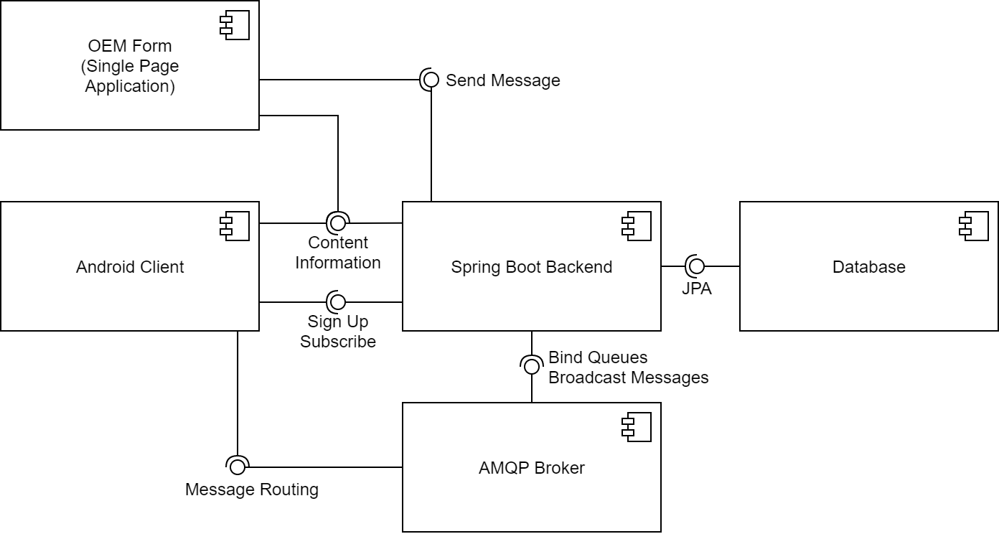

## Messaging Service Crossplattform Student Project

Together with Fabian Egl, Michael Scheurer and Tim Schuster this project was implemented as part of our studies. It is a messaging service from which messages can be sent to Android Automotive application via a web frontend using AMQP. Everything is controlled centrally via a Spring Boot backend.
The architecture is illustrated here:


### Getting Started 

Dieser Teil der Dokumentation beschreibt wie das Projekt lokal lauffähig gemacht werden kann.
Es handelt sich dabei um eine Android Automotive App, ein Spring Boot Backend und ein Angular Webfrontend.

### Docker-Compose für Backend, OEM-Frontend, Datenbank und RabbitMQ Broker (für ein komplettes Setup muss hier noch Android und der Emulator installiert werden wie im kompletten Setup beschrieben, siehe unten!)
Für einen schnellen Start bietet es sich an, das vordefinierte docker-compose.yml file im Root-Verzeichnis des Repositories zu verwenden, um alle Komponenten bis auf die Android-App zu starten und verwenden zu können. Mit dem Befehl `docker-compose up` werden dann individuelle Docker-container gestartet und entsprechend miteinander verknüpft. Durch das Anhängen des Bezeichners der jeweiligen Komponente aus dem yml-file ist es zudem möglich, nur einzelne Teile des Setups zu starten (z.B. `docker-compose up webview`). 

Die **Konfiguration** des Setups erfolgt über die ebenfalls im Root-Verzeichnis liegende Datei **.env**. Hier können folgende Parameter angepasst werden:

| Parameter | Beschreibung|
| ------ | ------ |
| SPRING_PROFILES_ACTIVE           | Das Konfigurations-Profil, welches bei der Ausführung des Backends verwendet werden soll |
| DB_SOURCE                        | Die Addresse inkl. Port, unter welcher die Datenbank erreichbar ist |
| DB_USERNAME, DB_PASSWORD         | Zugangsdaten für die Datenbankanwendung |
| AMQ_BROKER_URL                   | Die Adresse (IP oder URL), unter welcher der RabbitMQ-Broker erreichbar ist |
| AMQ_BROKER_USER, AMQ_BROKER_PASS | Zugangsdaten für den Rabbit-MQ Broker, welcher vom Backend verwendet wird |
| PUBLIC_BACKEND_URL               | Öffentlich erreichbare IP oder URL, über die das Backend erreichbar ist. Dieser Parameter muss so gewählt werden, dass die URL von den Clients (Nutzern des Web-Frontends) erreicht werden kann (z.B. via public Domain) |

**HINWEIS**: Es ist unter Umständen erforderlich, das Docker-Image für das Web-Frontent manuell neu zu bauen, wenn der Paramenter PUBLIC_BACKEND_URL angepasst wurde. Dies ist möglich über den Befehl `docker-compose build --no-cache webview` und einem anschließenden `docker-compose up webview`.

Zur Verwendung des Systems in der Android App muss dort anschließend nur in der build.gradle im Abschnitt defaultconfig{} oder in den Product flavors die Adresse des Brokers angepasst werden. Dabei muss beachtet werden, dass hier nicht "http://" oder "https://" Protokoll im Präfix angegeben werden darf (da im Hintergrund stattdessen das Protokoll AMQP verwendet wird). Hier finden sich auch die Zugangsdaten, falls diese im Broker verändert wurden. Ebenfalls muss der Parameter BACKEND_URL in den entsprechenden product-flavors angepasst werden.


### Komplettes Setup (inklusive Backend), hier kann der Devlopment Branch benutzt werden, Nutzung von lokalem Backend
1. Zuerst benötigt man [Android Studio](https://developer.android.com/studio) und [Intellij](https://www.jetbrains.com/de-de/idea/download/#section=windows). Beides sollte lokal installiert werden.
2. Klonen des Repositories beispielsweise mit git clone https://github.com/Js109/Js109-Messaging_Service_Crossplattform_Student_Project.git
3. Öffnen des Projekts in Android Studio über ```File > Open``` und im Ordner ```elektrobit > automotive-frontend``` 
4. Klicke in Android Studio auf ```Tools > SDK Manager```, füge den Haken bei ```Show Package Details``` hinzu und installiere von Android 9.0 Erweiterungen wie im Bild gezeigt 
5. Aufsetzen des Android Automotive Emulators, wofür die Canary Version von Android Studio heruntergeladen werden muss (da die Google Play Services nicht im normalen Emulator enthalten sind). Dazu klicken wir auf ```Tools > SDK Manager > Updates``` und wählen ```Canary Channel``` aus und drücken auf ```Check now```. Sie werden dann auf die Preview release Seite geleitet https://developer.android.com/studio/preview, wo sie die Version ```4.2 Canary 9``` downloaden müssen. Nach anschließendem Entpacken gehen Sie in den Ordner unter ```android-studio-ide-202.6795674-windows\android-studio\bin``` und klicken auf ```studio64.exe```. Zur Sicherheit sollten Sie die installierte Android Version schließen. Es öffnet sich die Android Studio Canary Version, wo sie auf ```Tools > AVD Manager``` klicken. Dort klicken Sie auf ```Create Virtual Device```, ```Automotive``` und wählen den ```Automotive 1024p landscape``` aus, klicken next und wählen Pie als Target mit dem API Level 28 aus. Anschließend genügt next und finish zum Fertigstellen der Installation.
6. Erneutes Öffnen der installierten stable Android Studio Version nach Schließen der Canary Version erlaubt jetzt das Ausführen der Anwendung mit der hinterlegten Run Configuration und dem eben erstellten Android Emulator mit Google Play Services. 
7. Anschließend soll Intellij geöffnet werden und dort der `backend` Ordner geöffnet werden. Falls noch nicht geschehen, sollten die Spring Boot Plugins für IntelliJ installiert werden. Danach sollte IntelliJ automatisch die zwei run configurations finden die aktuell vorhanden sind: `CdsApplication_Dev` und `CdsApplication_Prod_Postgres`.
Durch starten der `CdsApplication_Dev` (In-Memory Datenbank) oder `CdsApplication_Prod_Postgres` (lokale, persistente Postgres Installation oder Dockercontainer und dem Setzen von `DB_SOURCE=jdbc:postgresql://localhost:5432/postgres;DB_USERNAME=postgres;DB_PASSWORD=root` als Systemumgebungsvariablen kann diese benutzt werden. 

8. Anschließend muss das Angular Frontend gestartet werden, welches im Laufe des Projekts das Mustache-Webfrontend ersetzt hat.
Dazu muss eine aktuelle Version von Node.js installiert werden. Anschließend müssen folgende Kommandos ausgeführt werden:
`npm install`
`ng serve`
`ng serve --open`.
Anschließend kann über `http://localhost:4200/topic` ein Topic erstellt werden.
Danach kann über `http://localhost:4200/message` eine Nachricht verschickt werden, die dann auf dem Android device ankommt, wenn sich dieser auf das spezifische Topic subscribed hat.
7. Notifications auf dem Android Device kommen nur an, wenn die App auf ein Topic subscribed ist.
(Falls Probleme auftreten siehe auch RabbitMQ Installation weiter unten)


-----------------------------
Zusätzliche Dokumentation, kann ergänzend hilfreich sein

### Spring Boot Backend mit IntelliJ

In IntelliJ kann einfach der `backend` Ordner geöffnet werden. Falls noch nicht geschehen, sollten die Spring Boot Plugins für IntelliJ installiert werden. Danach sollte IntelliJ automatisch die zwei run configurations finden die aktuell vorhanden sind: `CdsApplication_Dev` und `CdsApplication_Prod_Postgres`.
Die `CdsApplication_Dev` run configuration nutzt eine in memory h2 Datenbank für die Datenverwaltung und kann somit ohne externe DB gestartet werden, während die `CdsApplication_Prod_Postgres` eine lokale Postgres DB unter `localhost:5432` erwartet, für diese DB kann auch einfach der `db` container über `docker-compose` gestartet werden (`docker-compose up db`).

### Deployment des Spring Boot Backend und zugehöriger Datenbank mit Docker

Im Projekt Ordner in dem die docker-compose.yaml Datei liegt`docker-compose up` ausführen, um alle Container zu starten und initial zu builden. Mit `docker-compose build` können die Container bei Bedarf neu gebuildet werden. Es gibt aktuell zwei Container: `db` und `backend` die können einfach an die Befehle angehängt werden, dann werden diese nur für den ausgewählten Container ausgeführt. Also z.B. `docker-compose up db` startet nur die DB. Backend sollte dann wie wenn es in IntelliJ gebuildet wird unter localhost:8080 zu erreichen sein. `DB` unter localhost:5432 und sollte ohne Probleme mit der Postgres run configuration für das Backend laufen.

### Angular Setup mit Webstorm
1. Installieren von aktueller Webstorm Version.
2. Öffnen des Ordners 'webview' im Gesamtprojekt.
3. Installation von Node.js in aktueller Version.
4. Anschließend müssen folgende Kommandos ausgeführt werden:
`npm install`
`ng serve`
`ng serve --open`.
5. oder auswählen der Run Configurations `Local Backend Configuration` oder `Global Backend Configuration`. Die lokale Konfiguration benutzt das lokal gehostete Backend.

### Deployment eines eigenen Rabbit-MQ Brokers
Standardmäßig wird von der Applikation ein in der BW-Cloud gehosteter Rabbit-MQ Broker verwendet. Falls dieser nicht verfügbar ist, oder ein selbst gehosteter Broker gewünscht wird, kann dieser in wenigen Schritten mithilfe von Docker eingerichtet werden.

#### Docker-Container setup
Das verwendete Docker-Image ist hier zu finden: https://hub.docker.com/_/rabbitmq

**Hinweis**: Zur Einrichtung empfiehlt es sich, statt dem Basis-image `rabbitmq:3` die Variante mit der Management-Oberfläche `rabbitmq:3-management` zu verwenden, da dadurch die Interaktion mit dem Broker (wie das anlegen eines Nutzers) vereinfacht wird.

Der folgende Befehl ist ein Beispiel für das Starten des Containers mit Docker:

`docker run -d --hostname my-rabbit --name some-rabbit -p 5672:5672 -p 8080:15672 rabbitmq:3-management`

Dabei kann der Name (hier: "some-rabbit") beliebig gewählt werden. In diesem Beispiel werden die grundlegenden Ports `5672` und `8080` von außerhalb des Containers bereitgestellt, wobei ersterer für die Verbindung von Clients benötigt wird, und letzterer für die Management-Weboberfläche zuständig ist. Diese Ports können natürlich bei Bedarf oder Konflikten mit bereits existierenden Containern angepasst werden. In der folgenden Beschreibung wird jedoch die oben dargestellte Beispielkonfiguration verwendet.

#### Konfiguration
Wurde der Container erfolgreich gestartet, so kann über die Adresse des Docker-hosts und dem Port 8080 die Management-Oberfläche aufgerufen werden. Zum Anmelden werden die Standard `Anmeldeinformationen guest:guest` verwendet. Anschließend kann der in der Applikation für die Clients verwendete Nutzer angelegt werden. 

Dazu wechselt man in den `Admin-Reiter` und wählt anschließend auf der rechten Seite `Users` aus. Nun lassen sich unter dem Punkt `Add user` die Zugangsdaten für einen neuen Nutzer eintragen. In unserer Applikation werden die Daten `android_cl:supersecure` verwendet. Es können auch andere Daten verwendet werden, müssen dann aber in der Android-App und im Backend angepasst werden. Der Tag Management muss gesetzt werden, damit der Nutzer die Berechtigung hat, sich auf ein Topic zu subscriben.

Anschließend benötigt der User noch die Berechtigung für den Virtual Host /.


### Emulator in Android Studio
Um einen Emulator für Automotive aufzusetzen kann dieser Anleitung gefolgt werden: 
https://developer.android.com/training/cars/testing#test-automotive-os \
Dabei kann aber das Problem wie hier beschrieben auftreten:
https://stackoverflow.com/questions/57968790/android-automotive-emulator-no-system-images-installed-for-this-target

Um es zusammenzufassen:
Anscheinend kann man Automotive System Images für den Emulator nur in der Canary-Version von AS vergeben.
Die kann man unter ```Settings > Behavior & Appearance > System Settings > Updates``` auswählen, außer man hat AS über die Jetbrains Toolbox installiert, dann wählt man dort die andere Version aus.
Dann unter ```Settings > Behavior & Appearance > System Settings > Android SDK > SDK Tools``` sowohl ```Andoid Auto API Simulators``` als auch ```Auto Desktop Head Unit emulator``` auswählen.
An der Stelle kann man auch wie in https://developer.polestar.com/ unter Emulator beschrieben das Polestar image registrieren.
Dann sollte man im AVD Manager beim Anlegen eines Automotive Device bei System Image "Pie" als auswahl haben.
Wenn Polestar registriert ist, ist das entsprechende Image unter dem Tab x86, heißt dort aber auch einfach Pie.

Um eine Sache klar zu machen: wenn ein neues Device anlegt wird und z.B. Automotive > Polestar 2 ausgewählt wird ist das nur die Hardwaredefinition, wenn dann im nächsten Schritt nicht zum Polestar image gewechselt wird ist trotzdem das standard Android Automotive ausgewählt.

Gutes Tutorial um ein erstes Projekt zu erstellen und ein Verständnis für Android Automotive Anwendungen zu bekommen:
https://codelabs.developers.google.com/codelabs/automotive-getting-started/index.html#0


### Docker Compose Startup von Angular Frontend und Spring Boot Backend
1. Stelle sicher, dass Docker Compose installiert ist
2. Führe folgende Befehle in der Kommandozeile aus: 
`docker-compose kill`
`docker-compose down`
`docker-compose up`


## Probleme und Designentscheidungen:
Seit Beginn des Projekts war angedacht das `Android Open Source Projekt` selbst bauen und verändern zu können, um so einen Mehrwert zu schaffen, der über die Standardfunktionsweise von Androidanwendungen hinaus geht. Aus diesem Grund haben wir einen Build-Server bekommen, der für den Build ausreichen sollte. 
Leider stellte sich nach vielen intensiven Stunden Arbeit bei mittelmäßiger Dokumentation durch Google, teilweisen Erfolgen des Bauens (nach mehreren Stunden jeweils) und viel Lernerfolgen erst beim Überprüfen lassen des Spezialistenteams von Elektrobit heraus, dass die Hardware, insbesondere der RAM mit 8GB zu schwach ist. So hat Isabella und Marcel entschieden den AOSP Build aus dem Projekt zu nehmen. Es war am Anfang des Projekts nicht bekannt, dass mindestens 16 GB eine harte Anforderung für den AOSP Build sind.

### Driver Distraction konnte nicht implementiert werden, weil:
die neuesten verfügbaren Android Automotive Emulatoren (sogar die aus der Beta Version) laufen alle auf API28. Sowohl der Standard Automotive (1024p landscape) und der Polestar 2. Für erweiterbare Features für Driver Distraction wird API Version 29 oder höher benötigt. Einfachste Driver Distraction Einschränkungen, die über den Standardfall hinaus gingen laufen nicht in diesen Emulatoren. Getestet wurde dies durch eine Anwendung, die Isabella mit diesen Features geschickt hat - welche aber nicht im Emulator funktionierte. (Elektrobit verwendet selbst ein spezielles Hardwaredevice dafür)
So hat Isabella und Marcel entschieden den Driver Distraction Aspekt aus dem Projekt zu nehmen. Der bisher entstandene Quellcode liegt auf dem Branch `driver_distraction`

### Wechsel von Mustache auf Angular
Als im Laufe des Projekts klar wurde, dass wir ausführliche Statistiken und Diagramme einbauen möchten haben wir uns dazu entschieden Angular als Webfrontend aufzusetzen. Ein weiterer Punkt für Angular war, dass das Entwicklerteam im Rahmen des Studentenprojekts Erfahrungen mit diesem Framework machen wollte. Nach einigen Erfahrungen mit Angular wird dieses als sehr angenehm empfunden und der Wechsel keineswegs bereut! Hier benutzen wir Typscript als Programmiersprache.

### Roboto, Open Sans, Montserrat und Playfair wurden als Schriftarten für Nachrichten ausgewählt
Sowohl im Webfrontend mit Angular, als auch in Android werden die Schriftarten Roboto, Open Sans, Montserrat und Playfair Display für Nachrichteninhalte unterstützt. Als Grund ist hierfür anzugeben, dass diese Schriftarten standardmäßig von Android unterstützt werden, lizenzfrei zugänglich und benutzbar sind. Bekannte Schriftarten wie Times New Roman müssen lizensiert werden und können aber auch in Android hinzugefügt werden. Mit den genannten 4 Schriftarten ist man aber auf der sicheren Seite und garantiert erfolgreiches Übertragen von Nachrichten.


